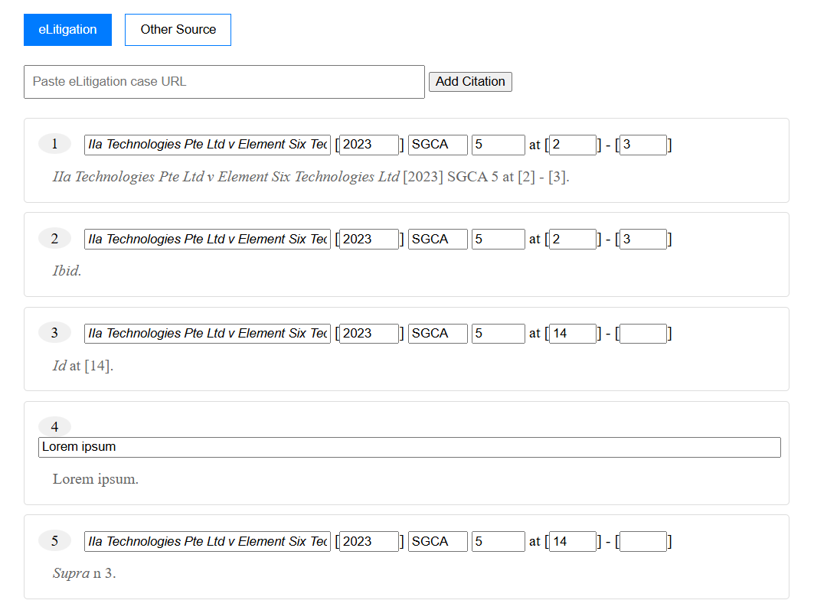

# SAL Style Guide Citation Generator
(work in progress) Legal writing is tedious, but forgetting to do your citations and having to figure out what goes where at the end makes it a million times more painful. 

While other citation formats like APA are extensively documented, the SAL Style Guide may be slightly overwhelming on the face of it. This project aims to aid Law Students and Legal Professionals in Singapore to stay organised.

## Where I'm at now

- currently only takes eliti links and requires manual input for case names.
- ibid, id, supra references (note: currently broken for manual citations).

## Roadmap
- will be integrating webscrapers to try and automate field inputs.
- will be working on other input fields: foreign cases (EU, UK, US); journals (SAcLJ etc.); statutes.
- it is noted that the SLR number is preferred for SG cases, I will be implementing that in the near future as well!

## Endgoal?
- free use webapp for all in the legal industry!
