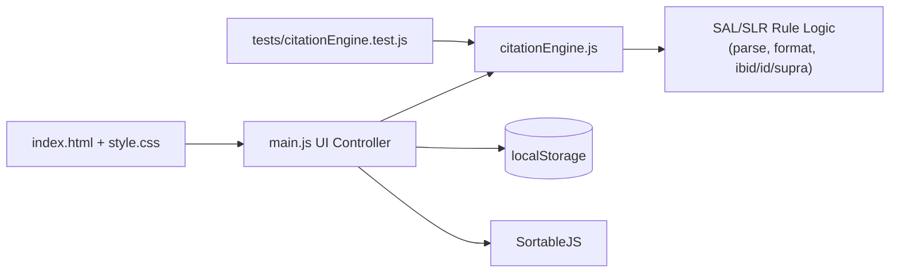

# SAL Citation Generator

Browser-based citation helper for Singapore legal writing.  
It generates case citations and short-form references aligned to the current project scope from:

- `SAL_Style_Guide_Quick_Reference_2007_Ed.pdf`
- `SLR_Style_Guide_2021.pdf`

The app is intentionally lightweight (no backend): open `index.html`, add citations, reorder by drag-and-drop, and copy the generated list.

## What it does

- Parses eLitigation URLs (eg `https://www.elitigation.sg/gd/s/2023_SGCA_5`) into neutral citation fields.
- Supports manual entry of case details:
  - case name
  - optional short name (used in `supra` references)
  - optional law report citation (eg `SLR(R)` citation, preferred when available)
  - neutral citation fields (year / court / case number)
  - pinpoint paragraph(s)
- Applies short-form logic for cases:
  - `Ibid.` for immediate repeat with same pinpoint
  - `Id, at [x].` for immediate repeat with different pinpoint
  - `short name, supra n N, at [x].` for non-consecutive repeat
- Supports free-text manual citation entries.
- Persists working state in `localStorage`.
- Copies fully numbered citations to clipboard.

## Scope and style-guide alignment

Implemented behavior is based on the provided guides for this repository's current feature set:

- Case citations prefer SLR/report citation when available; otherwise neutral citation (`[year] SGXX n`).
- Pinpoint references use paragraph format (`at [x]` or `at [x]-[y]`).
- Subsequent case references use `Ibid` / `Id` / `supra n` patterns.

Not yet implemented:

- Full automatic report-citation lookup from LawNet.
- Journals, legislation, and foreign citation generators.
- Annual Review paragraph-based supra variant.

## Architecture


```mermaid
flowchart LR
    UI[index.html + style.css] --> Controller[main.js UI Controller]
    Controller --> Engine[citationEngine.js]
    Controller --> Storage[(localStorage)]
    Controller --> Sortable[SortableJS]
    Engine --> Rules["SAL/SLR Rule Logic\n(parse, format, ibid/id/supra)"]
    Tests[tests/citationEngine.test.js] --> Engine
```

## Repository layout

- `index.html`: App shell and controls.
- `style.css`: Responsive UI styling.
- `main.js`: Event handling, rendering, state, sorting, clipboard.
- `citationEngine.js`: Pure citation parsing/formatting/rule engine.
- `tests/citationEngine.test.js`: Automated tests for core logic.

## Run locally

1. Install Node.js 18+ (tested on Node 24).
2. Run tests:

```bash
npm test
```

3. Open `index.html` in a browser (or serve with any static server).

Example static server (optional):

```bash
npx serve .
```

## Testing

Current automated tests cover:

- eLitigation URL parsing
- full neutral citation formatting
- `Ibid`, `Id`, `supra` transitions
- text citation normalization

Run:

```bash
npm test
```

## Notes

- Citation generation is assistive, not a substitute for final legal proofreading.
- For Singapore cases, fill in the SLR/report citation manually when known to follow guide preference.
