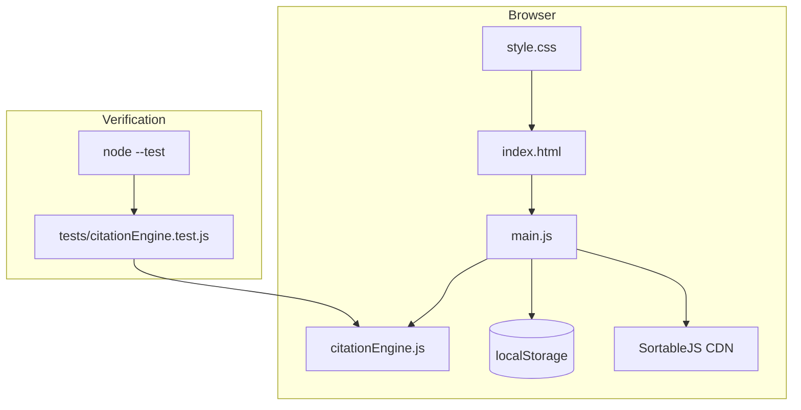

# Architecture

## Data flow summary

1. User submits URL/text in UI.
2. `main.js` creates/updates citation items.
3. `citationEngine.js` computes formatted outputs and short-form references.
4. `main.js` renders numbered citation cards and stores state in `localStorage`.
5. Drag-and-drop reorder triggers recomputation and rerender.
