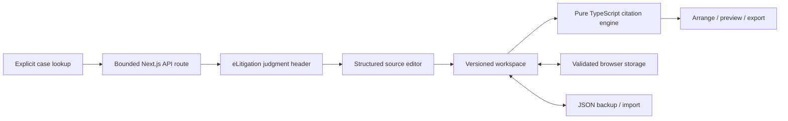

# Architecture

## One application, one citation engine

```mermaid
flowchart LR
  Forms[Structured source editor] --> State[Versioned workspace]
  State --> Engine[Pure TypeScript citation engine]
  Engine --> List[Arrange / preview / export]
  State <--> Storage[Validated browser storage]
  State <--> Backup[JSON backup / import]
  Lookup[Explicit case lookup] --> Route[Bounded Next.js API route]
  Route --> EL[eLitigation judgment header]
  EL --> Forms
```

## Module boundaries

- `lib/types.ts`: Footnote, source type, citation output and workspace contracts.
- `lib/schema.ts`: Field definitions and defaults shared by forms, validation and storage.
- `lib/citationEngine.ts`: Parsing, validation, source identity, full/short formatting and escaped HTML. No network or browser state.
- `lib/workspace.ts`: Strict v3 import, legacy v2 migration, linked-source updates. Invalid data is rejected as a whole; entries are never silently dropped.
- `lib/export.ts`: Rich clipboard with plain-text fallback, HTML/text rendering and downloads.
- `lib/elitigation.ts`: Extracts a case name only from a matching judgment header.
- `app/api/elitigation/route.ts`: Canonical fixed-origin HTTPS requests, redirects disabled, 10-second timeout, 5 MB response limit, daily cache and manual fallback.
- `components/CitationManager.tsx`: Orchestrates editing, per-type session drafts, undo, sorting, persistence and exports.
- `app/page.tsx` and `app/globals.css`: Responsive editorial workspace, navigation and style explanations.

## State and citation identity

A footnote has its own ID and a `sourceId`. **Cite again** retains the source ID and creates a new footnote ID. Updating the source propagates bibliographic fields to linked references while keeping their pinpoints and provisions independent.

Automatic short forms use complete bibliographic identity, not a case-name-only match. Incomplete structured sources and free text do not establish short-form references. Different book editions and different neutral citations remain distinct. A manually entered report-only citation and neutral-only citation are not assumed to represent the same decision; use linked references and update their report details together.

The first valid reference determines a supra target. Every reorder/removal recomputes the entire list. References never point to an incomplete footnote. Returning from a specific pinpoint to a source generally is rendered in full to avoid accidentally inheriting the earlier pinpoint.

## Storage

- Primary key: `sal-citation-generator:v3`.
- Reads `sal-citation-generator:v2` only if v3 is absent; the legacy original remains available.
- Hydration starts with an empty server-compatible view and reads browser data after mount. Saving starts only after loading.
- Rejects unsupported versions, non-string field values, duplicate IDs, conflicting linked sources and excessive payloads (5 MB / 2,000 entries / 20,000 characters per field).
- Corruption, quota failures and external-tab changes pause writes and display a persistent warning. Current in-memory work remains exportable.
- Session drafts and undo history are not part of the portable backup. Backups contain saved footnotes.

## Trust boundaries

Source text is escaped before entering HTML previews, clipboard HTML or export. Imported source URLs are never fetched automatically. The lookup API constructs a fixed eLitigation URL from parsed year/court/decision fields; it never accepts an arbitrary fetch destination. Only the matching case header is read, avoiding an unrelated SLR citation from the judgment body. User workspaces are never sent to that API.

No application login, analytics, database, external font request or LawNet integration is included. Public-host abuse controls can be configured at the hosting platform if needed.
